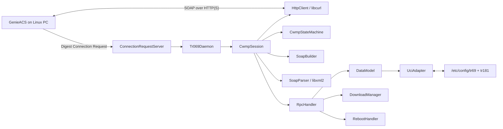
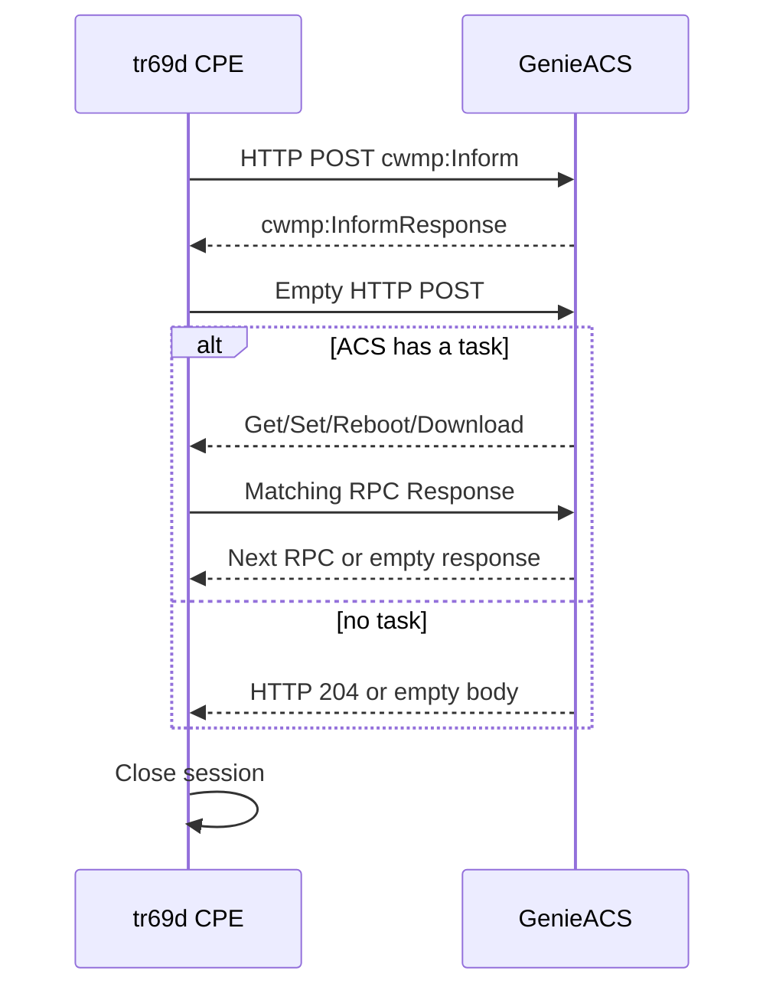
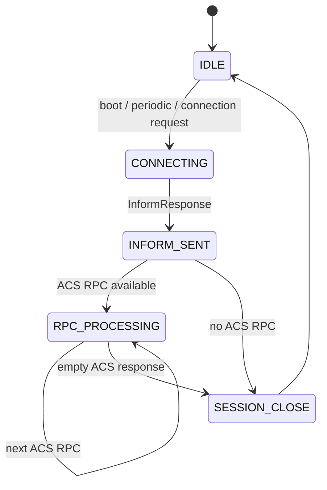
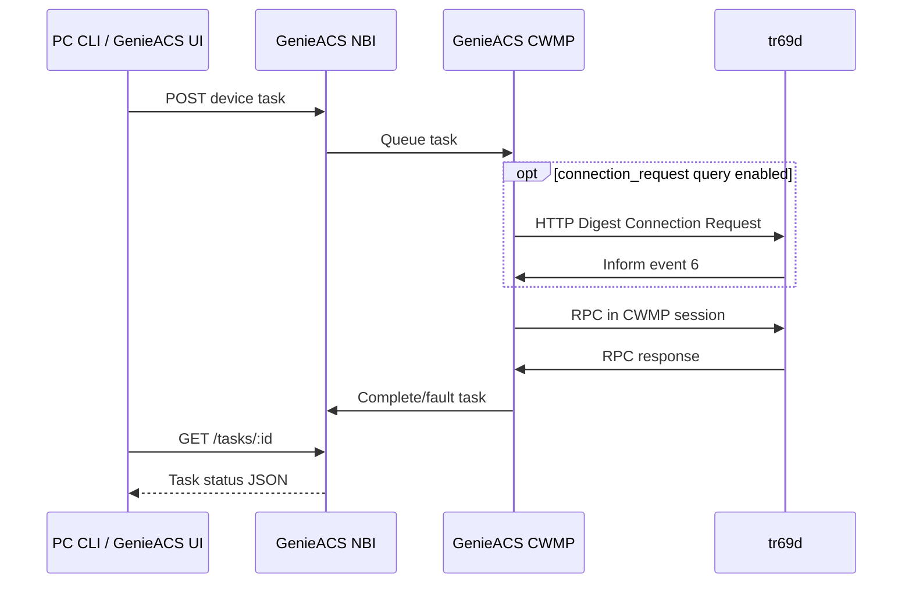

# System design

## Component diagram

## CWMP Inform session

## State machine

## TR-181 to UCI mapping

| TR-181 path | UCI key | Type | Access |
|---|---|---|---|
| `Device.DeviceInfo.Manufacturer` | `tr181.device.manufacturer` | string | read-only |
| `Device.DeviceInfo.ManufacturerOUI` | `tr181.device.manufacturer_oui` | string | read-only |
| `Device.DeviceInfo.ProductClass` | `tr181.device.product_class` | string | read-only |
| `Device.DeviceInfo.ModelName` | `tr181.device.model_name` | string | read-only |
| `Device.DeviceInfo.SerialNumber` | `tr181.device.serial_number` | string | read-only |
| `Device.DeviceInfo.SoftwareVersion` | `tr181.device.software_version` | string | read-only |
| `Device.ManagementServer.URL` | `tr69.mgmt_srv.url` | string | read/write |
| `Device.ManagementServer.Username` | `tr69.mgmt_srv.username` | string | read/write |
| `Device.ManagementServer.Password` | `tr69.mgmt_srv.password` | string | write; reads empty |
| `Device.ManagementServer.PeriodicInformEnable` | `tr69.periodic_inform.enable` | boolean | read/write |
| `Device.ManagementServer.PeriodicInformInterval` | `tr69.periodic_inform.interval` | unsignedInt | read/write |
| `Device.ManagementServer.ConnectionRequestURL` | computed from runtime IPv4 + `tr69.settings.port` | string | read-only |
| `Device.ManagementServer.ConnectionRequestUsername` | `tr69.conn_request.username` | string | read/write |
| `Device.ManagementServer.ConnectionRequestPassword` | `tr69.conn_request.password` | string | write; reads empty |

`ManufacturerOUI` and `ProductClass` extend the requested subset because CWMP Inform's `DeviceId` requires OUI and ProductClass. UCI values are accessed using `uci get`, `uci set`, and `uci commit`. Parameter names are mapped through a fixed allowlist before any command runs.

ACS URL/credentials and the periodic interval are re-read after `ubus call tr69 reload`.
Connection Request listener bind/port/credentials/auth are hot-reloaded internally; the
`tr69d` process must not be restarted after `SetParameterValues`.

## GenieACS task flow

## Download and reboot behavior

For Download, the CPE immediately acknowledges with status `1`, ends the ACS task exchange, downloads to `/tmp/tr069-downloads`, and starts a TransferComplete session using `7 TRANSFER COMPLETE` plus `M Download`. This keeps the transfer outside the RPC response round trip. Firmware application is intentionally out of scope.

Reboot is acknowledged before `RebootHandler` runs. With `mock_mode=1`, only a warning is logged. With `mock_mode=0`, `/sbin/reboot` is invoked; the restarted daemon emits `1 BOOT`.
