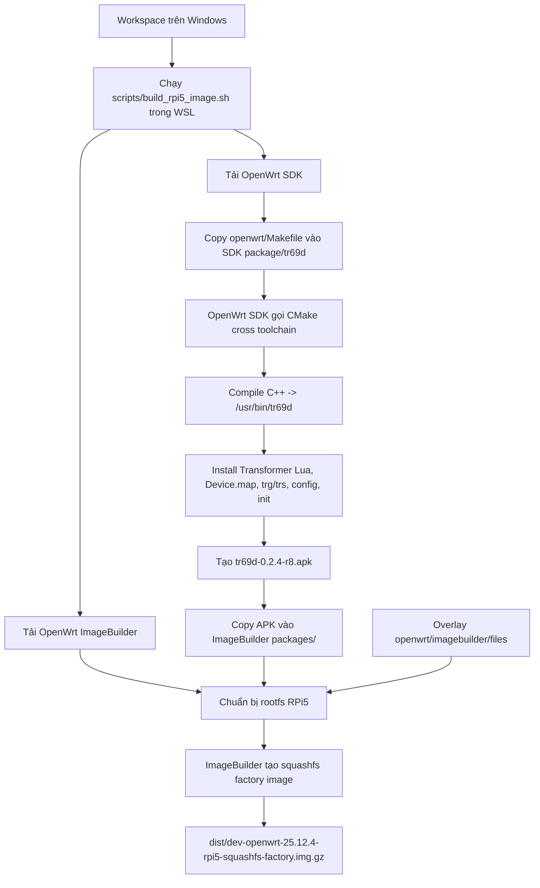

Quy Trình Build OpenWrt, tr69d Và Transformer

Tài liệu này mô tả chi tiết pipeline build hiện tại của project `Mock_Tr69d`: build trên WSL, cross-compile `tr69d` bằng OpenWrt SDK, đóng gói Lua Transformer vào package, sau đó nhúng package vào firmware Raspberry Pi 5 bằng OpenWrt ImageBuilder.

1. Tóm Tắt Ngắn Gọn

Project hiện tại không dùng Docker để build firmware. Docker chỉ có thể dùng cho ACS/GenieACS hoặc mock server phục vụ test.

Pipeline build firmware như sau:

Windows workspace
  -> chạy script trong WSL/Linux
  -> tải OpenWrt SDK + OpenWrt ImageBuilder
  -> dùng OpenWrt SDK cross-compile C++ tr69d
  -> đóng gói thành tr69d-0.2.4-r8.apk
  -> copy package sang ImageBuilder
  -> copy overlay cấu hình RPi5
  -> ImageBuilder tạo firmware .img.gz
  -> artifact cuối nằm trong dist/

Điểm quan trọng:

- tr69d là binary C++ nên phải cross-compile cho OpenWrt/RPi5.
- transformer.lua, cli.lua, Device.map, trg, trs, config UCI và init script =>script/config, được copy vào package.
- Package OpenWrt tên là tr69d; package này chứa cả binary daemon và Transformer.
- Firmware RPi5 được tạo bằng ImageBuilder, không build toàn bộ OpenWrt source tree từ đầu.

2. Vì Sao Dùng WSL?

OpenWrt SDK và ImageBuilder là toolchain Linux. Chúng cần:

- bash
- make
- tar
- zstd hoặc unzstd
- curl
- openssl
- filesystem hoạt động tốt với symlink, quyền executable và case-sensitive behavior

Vì workspace nằm trên Windows, script build xử lý như sau:

sh
PROJECT_ROOT=/mnt/c/Users/DELL/Desktop/Mock_tr69_clone/Mock_Tr69d
WORK_DIR=$HOME/.cache/dev-openwrt/25.12.4-bcm27xx-bcm2712

Lý do để SDK/ImageBuilder trong $HOME/.cache/... của WSL:

- OpenWrt build system không thích chạy trực tiếp trên NTFS mount /mnt/c.
- Build tree cần filesystem Linux ổn định hơn.
- Workspace code vẫn ở Windows để người dùng chỉnh sửa bình thường.
- Artifact cuối vẫn copy về dist/ trong workspace Windows.

3. Docker Có Dùng Để Build Không?

Không. Docker không nằm trong pipeline build firmware hiện tại.

Docker chỉ được dùng để chạy ACS/GenieACS hoặc mock ACS server, ví dụ:

docker/acs-mock/
GenieACS container

Build firmware không chạy trong Docker. Build firmware chạy bằng: scripts/build_rpi5_image.sh bên trong WSL/Linux.

4. Target OpenWrt Hiện Tại

Trong scripts/build_rpi5_image.sh, target đang cố định cho Raspberry Pi 5:

- OPENWRT_VERSION=25.12.4
- TARGET=bcm27xx
- SUBTARGET=bcm2712
- PROFILE=rpi-5


=> Từ đó script tải:
- text
- openwrt-sdk-25.12.4-bcm27xx-bcm2712_gcc-14.3.0_musl.Linux-x86_64.tar.zst
- openwrt-imagebuilder-25.12.4-bcm27xx-bcm2712.Linux-x86_64.tar.zst

=> SDK dùng để build package. ImageBuilder dùng để tạo firmware image.

5. Vai Trò Của OpenWrt SDK

OpenWrt SDK là môi trường cross-compile đã chuẩn bị sẵn cho đúng target.

Nó chứa:

- cross compiler
- sysroot
- headers/libraries OpenWrt
- package build system
- package.mk
- cmake.mk
- toolchain `aarch64-openwrt-linux-musl-*

Với RPi5 target bcm27xx/bcm2712, binary cuối phải chạy trên ARM64/OpenWrt musl, không phải Windows/WSL x86_64.

=> Vì vậy không thể lấy binary build bằng g++ trên WSL host rồi ném vào Pi. Nếu làm vậy sẽ gặp lỗi: (Exec format error) hoặc thiếu ABI/libc.

6. Cross-Compile tr69d Diễn Ra Như Thế Nào?

Cross-compile được điều khiển bởi package recipe: openwrt/Makefile


Package khai báo:
- make
- PKG_NAME:=tr69d
- PKG_VERSION:=0.2.4
- PKG_RELEASE:=8


Và dùng OpenWrt CMake integration:

```make
include $(INCLUDE_DIR)/package.mk
include $(INCLUDE_DIR)/cmake.mk
```

Điều này có nghĩa là mình **không tự gọi trực tiếp**:

```sh
aarch64-openwrt-linux-musl-g++
```

Thay vào đó, OpenWrt SDK gọi CMake với toolchain đúng. Trong log build sẽ thấy compiler dạng:

```text
aarch64-openwrt-linux-musl-gcc
aarch64-openwrt-linux-musl-g++
```

Quy trình bên trong:

```text
OpenWrt SDK make package/tr69d/compile
  -> đọc openwrt/Makefile
  -> copy CMakeLists.txt, src/, include/ vào BUILD_DIR
  -> chạy CMake cross toolchain
  -> compile C++ source thành /usr/bin/tr69d
  -> install vào package root
  -> tạo tr69d-0.2.4-r8.apk
```

## 7. Transformer Có Build Riêng Không?

Không. Transformer không phải binary native nên không cần cross-compile.

Các file Transformer là Lua/config:

```text
transformer/transformer.lua
transformer/cli.lua
transformer/maps/Device.map
```

Chúng được copy vào package trong bước `Package/tr69d/install` của `openwrt/Makefile`:

```make
$(INSTALL_DATA) $(TR69D_PROJECT_ROOT)/transformer/transformer.lua $(1)/usr/lib/tr69d/transformer.lua
$(INSTALL_DATA) $(TR69D_PROJECT_ROOT)/transformer/cli.lua $(1)/usr/lib/tr69d/cli.lua
$(INSTALL_CONF) $(TR69D_PROJECT_ROOT)/transformer/maps/Device.map $(1)/etc/transformer/maps/Device.map
```

Trên OpenWrt, Lua Transformer được chạy/interpreted bởi Lua runtime:

```text
/usr/lib/tr69d/transformer.lua
/usr/lib/tr69d/cli.lua
```

Daemon `tr69d` load Transformer API để gọi Lua khi ACS get/set parameter. CLI `trg` và `trs` cũng dùng cùng Transformer layer.

## 8. Package tr69d Chứa Những Gì?

Package `tr69d-0.2.4-r8.apk` chứa:

```text
/usr/bin/tr69d
/usr/bin/trg
/usr/bin/trs
/usr/lib/tr69d/transformer.lua
/usr/lib/tr69d/cli.lua
/etc/transformer/maps/Device.map
/etc/config/tr69
/etc/init.d/tr69
```

Trong đó:

- `/usr/bin/tr69d`: daemon C++ đã cross-compile.
- `/usr/bin/trg`: command get datamodel.
- `/usr/bin/trs`: command set datamodel.
- `/usr/lib/tr69d/transformer.lua`: logic Transformer.
- `/usr/lib/tr69d/cli.lua`: CLI bridge cho `trg`/`trs`.
- `/etc/transformer/maps/Device.map`: mapping TR-181 sang UCI.
- `/etc/config/tr69`: config UCI mặc định.
- `/etc/init.d/tr69`: init script cho OpenWrt procd.

Package dependencies:

```make
DEPENDS:=+libcurl +libxml2 +libstdcpp +libpthread +liblua +lua +ubus +libubus +libubox
```

9. Vai Trò Của ImageBuilder

Sau khi SDK build xong package `tr69d-0.2.4-r8.apk`, script copy package này sang ImageBuilder:

```sh
mkdir -p "$IB_DIR/packages"
cp "$PACKAGE_FILE" "$IB_DIR/packages/"
```

ImageBuilder sau đó được gọi:

```sh
make -C "$IB_DIR" image PROFILE="$PROFILE" PACKAGES="$PACKAGES" \
  FILES="$OVERLAY_DIR" ROOTFS_PARTSIZE=512
```

ImageBuilder không compile lại `tr69d`; nó chỉ lấy package đã build và install vào rootfs của image.


10. Quy Trình Build Từ Đầu Đến Cuối

### Bước 1: Chạy build script trong WSL

Từ workspace:

sh
scripts/build_rpi5_image.sh

### Bước 2: Script chuẩn hóa PATH

Script set PATH Linux:

```sh
export PATH="/usr/local/sbin:/usr/local/bin:/usr/sbin:/usr/bin:/sbin:/bin"
```

### Bước 3: Chọn workdir Linux

Nếu project nằm dưới `/mnt/c`, script để build tree trong:

```text
$HOME/.cache/dev-openwrt/25.12.4-bcm27xx-bcm2712
```

### Bước 4: Download SDK và ImageBuilder

Script tải SDK, ImageBuilder và `sha256sums` từ OpenWrt release.

### Bước 5: Verify checksum

Script chạy `sha256sum -c -` để đảm bảo SDK/ImageBuilder tải đúng.

### Bước 6: Extract SDK và ImageBuilder

Script giải nén bằng `unzstd` hoặc `zstd -d`. Nếu thư mục đã tồn tại thì không extract lại.

### Bước 7: Cài feeds cần thiết cho SDK

Nếu SDK thiếu feed/package cần cho build, script chạy:

```sh
./scripts/feeds update packages
./scripts/feeds update base
./scripts/feeds install curl libxml2 mbedtls lua ubus libubox
```

### Bước 8: Copy package recipe vào SDK

Script xóa package cũ trong SDK rồi copy recipe:

```sh
rm -rf "$SDK_DIR/package/tr069d" "$SDK_DIR/package/tr69d"
mkdir -p "$SDK_DIR/package/tr69d"
cp "$PROJECT_ROOT/openwrt/Makefile" "$SDK_DIR/package/tr69d/Makefile"
```

### Bước 9: Merge config SDK

Script chạy:

```sh
make -C "$SDK_DIR" defconfig
perl scripts/kconfig.pl + .config "$PROJECT_ROOT/openwrt/sdk-rpi5.config" > .config.new
mv .config.new .config
make defconfig
```

Mục đích:

- bật đủ dependency cần cho package
- khớp với target RPi5
- tránh thiếu lib khi compile

### Bước 10: Cross-compile package tr69d

Script chạy:

```sh
make -C "$SDK_DIR" package/tr69d/clean TR69D_PROJECT_ROOT="$PROJECT_ROOT"
make -C "$SDK_DIR" -j"$(nproc)" package/tr69d/compile V=s TR69D_PROJECT_ROOT="$PROJECT_ROOT"
```

`TR69D_PROJECT_ROOT` cho OpenWrt Makefile biết source thật nằm ở workspace Windows.

Trong `Build/Prepare`, Makefile copy source C++:

```make
$(CP) $(TR69D_PROJECT_ROOT)/CMakeLists.txt $(PKG_BUILD_DIR)/
$(CP) $(TR69D_PROJECT_ROOT)/src $(PKG_BUILD_DIR)/
$(CP) $(TR69D_PROJECT_ROOT)/include $(PKG_BUILD_DIR)/
```

Trong `Package/tr69d/install`, Makefile install binary, scripts, Transformer, map, config và init.

### Bước 11: Copy artifact package về dist

Script tìm package và copy về:

```text
dist/tr69d-0.2.4-r8.apk
dist/tr69d
```

### Bước 12: Copy package sang ImageBuilder

Script copy APK sang:

```text
$IB_DIR/packages/
```

ImageBuilder sẽ ưu tiên package local này khi build image.

### Bước 13: Chuẩn bị overlay

Script tạo overlay tạm:

```text
$WORK_DIR/overlay-rpi5
```

Sau đó copy `openwrt/imagebuilder/files/` vào đó và thay placeholder bằng thông tin Wi-Fi/root password/LAN IP.

### Bước 14: ImageBuilder tạo firmware

Script chạy:

```sh
make -C "$IB_DIR" image PROFILE="rpi-5" PACKAGES="$PACKAGES" \
  FILES="$OVERLAY_DIR" ROOTFS_PARTSIZE=512
```

ImageBuilder sẽ:

1. tạo rootfs OpenWrt cho RPi5
2. install package `tr69d`
3. install các package phụ trợ
4. copy overlay vào rootfs
5. tạo image squashfs factory
6. tính checksum

### Bước 15: Copy firmware về dist

Firmware cuối:

```text
dist/dev-openwrt-25.12.4-rpi5-squashfs-factory.img.gz
dist/dev-openwrt-25.12.4-rpi5-squashfs-factory.img.gz.sha256
dist/RPI5_IMAGE_CREDENTIALS.txt
```
## 9. Sơ Đồ Pipeline Build



## 10. Kết Luận

Quy trình build hiện tại có thể hiểu ngắn gọn như sau:

```text
Build không dùng Docker.
Build chạy trong WSL/Linux.
OpenWrt SDK cross-compile phần C++ tr69d.
Lua Transformer không compile, được đóng gói kèm package.
Package tr69d chứa daemon + transformer + map + CLI + config + init.
ImageBuilder install package đó vào firmware RPi5.
Artifact cuối nằm trong dist/.
```

